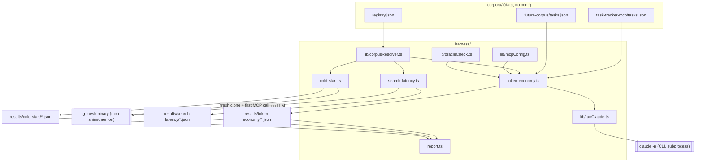
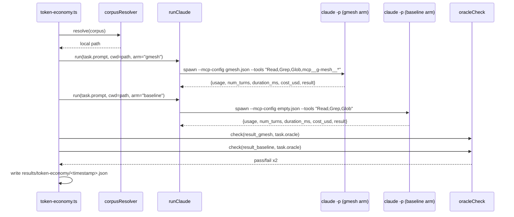
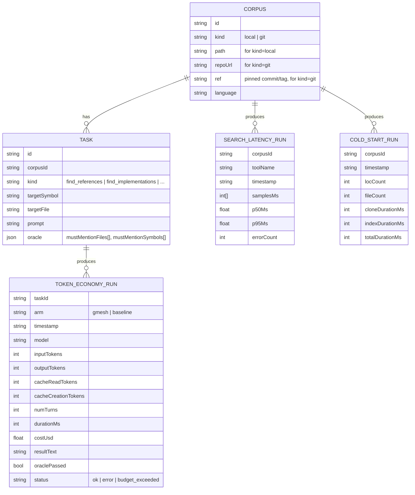

# g-mesh-bench v1

## Context & Problem

[g-mesh](../../../g-mesh) is a Rust MCP server that gives coding agents structural
code-graph tools for TS/JS projects (`find_definition`, `find_references`,
`find_callers`, `find_callees`, `find_implementations`, `get_file_outline`,
`get_dependencies`) instead of grep/manual reading. We want an ongoing, extensible way
to answer "is this actually worth it, and by how much" — not a one-off manual test —
and to keep tracking it as g-mesh evolves and as we add more tasks/codebases.

## Goals / Non-goals

**Goals**
- Measure token economy: does an agent spend fewer tokens completing the same
  code-navigation task with g-mesh vs. grep/Read/Glob only, without a drop in
  correctness.
- Measure raw g-mesh tool latency on a warm index, independent of any LLM.
- Measure cold-start (first bulk-index walk) time and how it scales with repo size,
  as a non-functional metric, kept separate from the above.
- Be extensible: new benchmark tasks and new test codebases ("corpora") should be
  addable as data, never as harness code changes.
- Persist results over time so regressions/improvements are visible as g-mesh changes.

**Non-goals**
- Not testing g-mesh's correctness/parsing accuracy in general (that's g-mesh's own
  `cargo test`/`npm test`).
- Not a CI gate — this is an offline measurement tool run on demand.
- Not covering g-mesh-on-Rust-codebases (out of scope: g-mesh only indexes JS/TS today).

## Constraints

- g-mesh only supports JS/TS, so it can't benchmark itself.
- Every token-economy run spends real API money — the harness must support a hard
  budget cap per run and must not require large sample counts to be useful in v1.
- The user's global `~/.claude/CLAUDE.md` tells agents "g-mesh is the first choice for
  code search" — that instruction must not leak into the baseline (no-g-mesh) arm.
- No existing code to build on; this is a from-scratch project, TypeScript-first
  since the MCP TS SDK and the target corpora are both TS/JS already.

## Options Considered

**Driving the token-economy experiment**
- **A. Shell out to `claude -p --output-format json`** (chosen) — the CLI already
  emits `usage`, `num_turns`, `duration_ms`, `total_cost_usd`, and the final answer
  text in one JSON object per run, and `--mcp-config`/`--strict-mcp-config`/`--tools`
  give exact, per-run control over whether g-mesh is even loaded. Zero extra runtime
  dependency beyond the CLI itself.
- **B. Claude Agent SDK, driven programmatically** — more code and more control over
  intermediate events, but nothing here needs intermediate events; the final-run JSON
  is sufficient. Unnecessary complexity for what this measures.
- **C. Manual subagent runs inside an interactive session** — not scriptable or
  repeatable unattended, can't be rerun on a schedule to track trends. Rejected.

**Corpus resolution**
- **A. Registry entries are `{kind:"local", path}` or `{kind:"git", repoUrl, ref}`;
  a resolver clones+pins `git` entries into a local cache dir** (chosen) — adding a
  corpus is a one-entry data change either way, and pinning a ref keeps runs
  reproducible even if upstream moves.
- **B. Git submodules per corpus** — pinning works, but adding/updating a corpus
  becomes a git operation instead of a data-only change, and submodules are awkward
  with throwaway clones (needed for the cold-start experiment). Rejected.
- **C. Vendor a snapshot copy of each corpus into the repo** — bloats the repo,
  can't test against an evolving upstream, and is a license problem for OSS corpora.
  Rejected.

## Chosen Approach

Node/TypeScript harness (`tsx`, no build step) with three independent experiment
runners sharing a small `lib/` of helpers, data-only task/corpus definitions in
`corpora/`, and flat timestamped JSON files under `results/` as the only persistence
— no database, since history is just "diff two JSON files."

## Components



- **`corpora/registry.json`** — list of corpus entries (`local` or `git`, pinned ref).
- **`corpora/<id>/tasks.json`** — task definitions for that corpus (see Data Model).
- **`lib/corpusResolver.ts`** — resolves a registry entry to a local filesystem path;
  for `git` entries, clones+checks out the pinned ref into `.cache/corpora/<id>/`
  (idempotent for warm experiments) or into a throwaway temp dir (cold-start, so no
  prior g-mesh index exists for that path).
- **`lib/mcpConfig.ts`** — builds the `--mcp-config` JSON for the two token-economy
  arms: `gmesh` (g-mesh server pointed at the built binary) and `baseline` (no
  servers at all).
- **`lib/runClaude.ts`** — spawns `claude -p ...`, captures stdout, parses the
  single JSON result object into a typed record.
- **`lib/oracleCheck.ts`** — checks a task's oracle (expected files/symbols) against
  the run's final answer text; returns pass/fail + which expectations were missed.
- **`token-economy.ts` / `search-latency.ts` / `cold-start.ts`** — one runner per
  experiment; each only knows its own result schema and never touches the others'.
- **`report.ts`** — reads a `results/<experiment>/` directory, renders a markdown
  summary table. Experiment-specific (no cross-experiment merging).

## Data Flow

Token-economy experiment, one task, both arms:



Cold-start experiment: `corpusResolver` clones the corpus fresh into a temp dir (new
path ⇒ no `~/.g-mesh/projects/<hash>/` exists yet) → `cold-start.ts` issues the first
MCP tool call directly against `g-mesh mcp-shim` with `CLAUDE_PROJECT_DIR` set to that
path → timer starts at spawn, stops at first successful tool response (this includes
the bulk-index walk, which g-mesh's own README confirms completes before any MCP
connection is accepted).

Search-latency experiment: same MCP stdio connection approach, but against an
already-warm corpus path, N repeated calls per tool type, no cloning, no LLM.

## Data Model



## Interfaces

```ts
// lib/runClaude.ts
interface RunClaudeOptions {
  cwd: string;
  prompt: string;
  mcpConfigPath: string;   // from mcpConfig.ts, empty-server file for baseline arm
  tools: string;           // e.g. "Read,Grep,Glob" or "Read,Grep,Glob,mcp__g-mesh__*"
  model: string;           // pinned explicitly, e.g. "claude-sonnet-5" — never "default",
                           // so trend comparisons aren't confounded by a default-model bump
  maxBudgetUsd: number;
}
interface RunClaudeResult {
  usage: { inputTokens: number; outputTokens: number; cacheReadTokens: number; cacheCreationTokens: number };
  numTurns: number;
  durationMs: number;
  costUsd: number;
  resultText: string;
  status: "ok" | "error" | "budget_exceeded";
}
function runClaude(opts: RunClaudeOptions): Promise<RunClaudeResult>;

// lib/oracleCheck.ts
interface Oracle { mustMentionFiles: string[]; mustMentionSymbols: string[] }
function checkOracle(resultText: string, oracle: Oracle): { passed: boolean; missed: string[] };

// lib/corpusResolver.ts
interface CorpusEntry {
  id: string;
  kind: "local" | "git";
  path?: string;            // kind=local
  repoUrl?: string; ref?: string; // kind=git
  language: "ts" | "js";
}
function resolveWarm(corpus: CorpusEntry): Promise<string>;   // cached checkout, reused
function resolveFresh(corpus: CorpusEntry): Promise<string>;  // throwaway clone, for cold-start
```

## Failure Modes & Edge Cases

- **`claude -p` exits non-zero / malformed JSON** → record `status: "error"`, exclude
  from aggregates, don't retry silently (retries would hide real instability).
- **`--max-budget-usd` cap hit** → CLI aborts the run; record `status:
  "budget_exceeded"`, distinct from a genuine completed answer.
- **g-mesh binary missing/not built** → preflight check before any experiment starts;
  abort with a clear message rather than letting every task fail individually.
- **Git clone of an external corpus fails** (network, ref force-pushed away) → skip
  that corpus with a warning; don't fail the whole suite.
- **Oracle false negative** (right answer, different phrasing) → not auto-correctable
  in v1; `report.ts` surfaces raw `resultText` alongside pass/fail so it can be
  eyeballed, not just trusted blindly.

## Open Questions / Risks

- **Run-to-run variance**: v1 runs each task once per arm. If numbers look noisy in
  practice, add repetitions (e.g. 3x, taking the median) — deferred until we see real
  data rather than guessed up front.
- **Oracle precision**: substring/mention-based grading is blunt. Acceptable for v1;
  revisit if false negatives turn out common.
- **Model pinning**: runner pins an explicit model string rather than "whatever's
  default" so historical comparisons aren't confounded by unrelated model upgrades —
  means the harness needs a deliberate decision to re-baseline when we do want to
  measure a model change.
- **Tier 2 (external OSS corpora)**: deferred — needs license review and pinned refs
  before any registry entry is committed; not required for v1's single local corpus.
