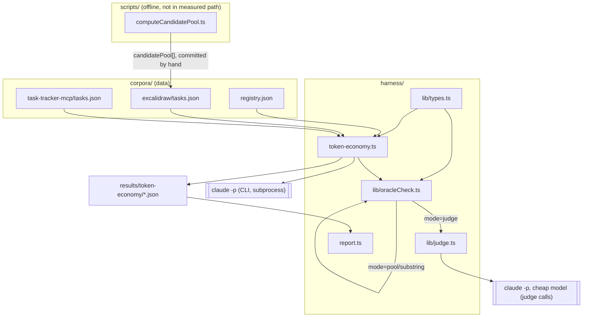
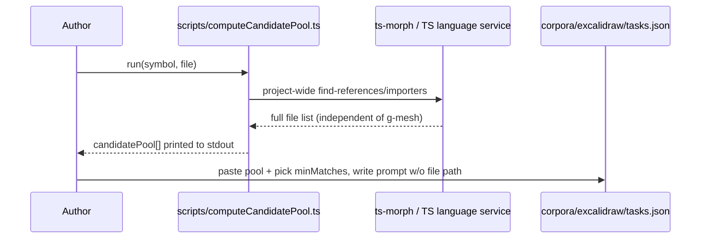
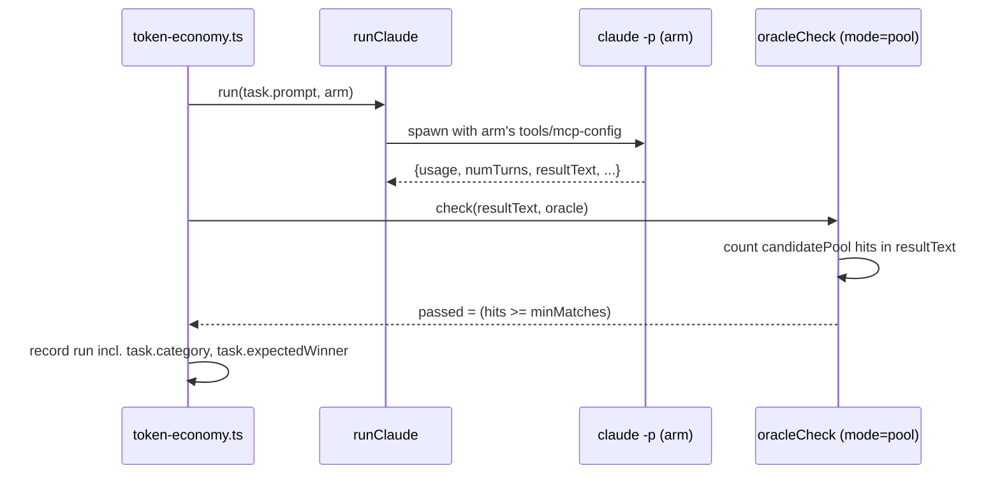
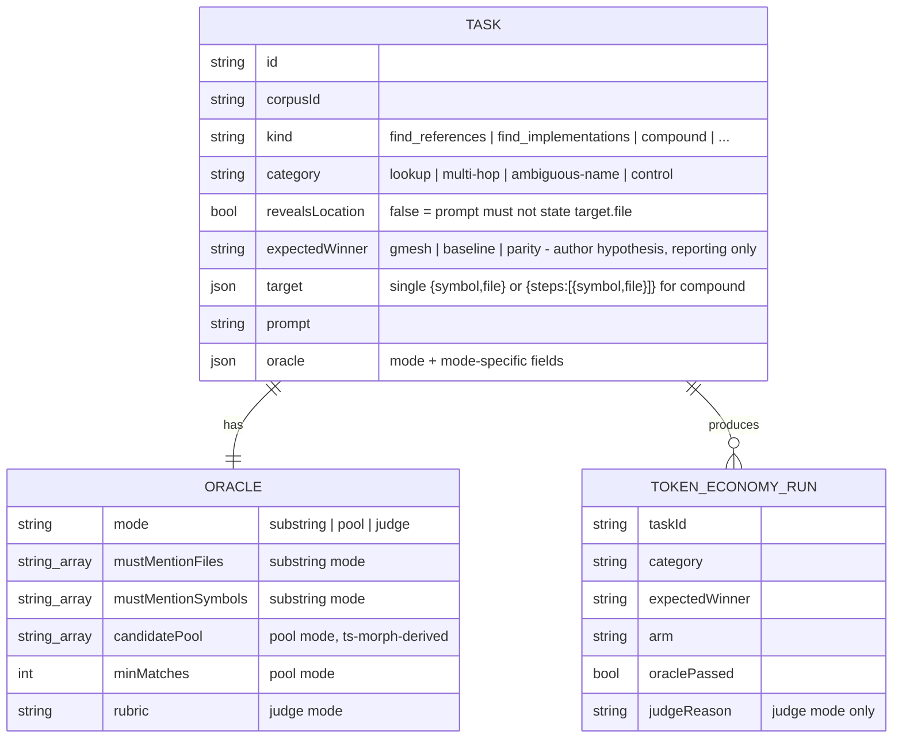

# g-mesh-bench v2: realistic tasks & a grading fix

## Context & Problem

v1's token-economy report on the `excalidraw` corpus shows g-mesh looking bad
(-71.3% aggregate token reduction, oracle pass rate 34/53 gmesh vs. 38/53
baseline). Manually inspecting the failing runs' `resultText` shows this is
largely **not real signal**:

- `ex-references-pointfrom-highfanout` and `ex-deps-package-math-incoming`
  (gmesh, 0/3 each): the agent's answers list 15+ and 10+ genuinely correct
  files respectively — but `harness/lib/oracleCheck.ts` does
  `resultText.includes(expected)` against a small hand-picked subset of a much
  larger valid pool (94 files import `@excalidraw/math`; the oracle hardcodes
  2). The model named a different, equally valid, subset → scored as failed.
- `ex-find-callers-mutateelement` (gmesh, 13 turns): the agent used
  `find_callers` then re-verified the result via `Grep` before answering
  ("Хорошо, подтверждено...") — real behavior, not noise, but it's being
  averaged into "token cost of g-mesh" without being called out as its own
  phenomenon.
- Every current task states the target's exact file in the prompt itself
  (`corpora/*/tasks.json`, e.g. "...the Trail interface defined in
  packages/excalidraw/animatedTrail.ts"). Real dev questions don't come with
  the file path attached — locating it is exactly the step where
  `find_definition`/`get_file_outline` should beat grep. Handing it away
  leaves g-mesh with only its fixed per-call tool-schema overhead exposed on
  what's effectively a trivial single-file lookup: its worst case, tested
  exclusively.
- Every task is a single lookup (one `find_references` call, one
  `find_implementations` call, ...). Nothing tests the multi-hop,
  chained-lookup shape (impact analysis, "what breaks if I change X") where a
  structural graph should compound its advantage over N sequential greps.
- Nothing tests ambiguous/common-word symbol names, the case where naive grep
  should generate the most false-positive noise.

We want v2 to still answer "is g-mesh worth it, and when" — but on task shapes
and a grading method that don't structurally favor one arm before either agent
runs a single tool call.

## Goals / Non-goals

**Goals**
- Fix oracle grading so pass/fail reflects actual correctness, not whether the
  model happened to pick the same valid subset the task author did.
- Add task shapes that don't reveal the target location in the prompt, so
  "find it" is actually part of what's measured.
- Add multi-hop/compound tasks (chained lookups) and ambiguous-name tasks
  (adversarial for grep), since neither exists today.
- Add a small number of control tasks where g-mesh is not expected to help,
  so the corpus isn't one-sided in either direction.
- Make token-economy and correctness read as two distinguishable signals in
  `report.ts`, without standing up a separate experiment/runner for it.

**Non-goals**
- Not touching `search-latency` or `cold-start` experiments — this is scoped
  to `token-economy` and its task corpus/oracle only.
- Not fixing the g-mesh bugs the v1 investigation docs found
  (`find_definition` missing `symbolId`, `.claude/worktrees` indexing,
  `find_references`/`find_callers` disagreement) — those are g-mesh-project
  tickets, not a benchmark-repo concern.
- Not trying to eliminate prompt-cache-locality variance beyond what v1
  already shipped (`warmCache`/`G_MESH_BENCH_WARM_CACHE` in
  `token-economy.ts`) — out of scope for this round.
- Not building an automated oracle-pool-freshness checker; corpora are
  pinned refs (`registry.json`), so a pool computed once for a pinned ref
  stays valid until that ref is deliberately bumped.

## Constraints

- Same real-API-cost constraint as v1: every added task multiplies real
  spend by `G_MESH_BENCH_REPS`; pool/judge grading must not require its own
  expensive LLM call per task by default.
- `harness/lib/types.ts`'s `BenchTask`/`Oracle` shapes are consumed by
  `token-economy.ts`, `oracleCheck.ts`, and implicitly by every
  `corpora/*/tasks.json` file — changes must be additive/backward-compatible
  enough that existing tasks keep working without a rewrite of every entry.
- Ground truth for pool-mode oracles must come from a method independent of
  g-mesh itself — grading g-mesh's answers against a pool g-mesh generated
  would be circular.
- Keep the "three metrics, never merged" philosophy from v1 (`README.md`):
  this doc only touches token-economy's task corpus and oracle, not the
  experiment boundary itself.

## Options Considered

**Oracle grading mechanism**
- **A. Threshold against a precomputed candidate pool** — for enumerable
  answers (files that call/import/implement X), precompute the *full* valid
  set once (offline, independent of g-mesh) and store it as
  `candidatePool` + `minMatches`; oracle counts pool-hits in `resultText`.
  Deterministic, no extra runtime API cost, fixes the exact bug found above.
  Doesn't help for open-ended reasoning tasks ("what breaks if I rename X")
  where there's no fixed enumerable pool.
- **B. LLM-judge** — a second, cheap-model call scores `resultText` against a
  natural-language rubric embedded in the task. Handles paraphrasing and
  open-ended/reasoning answers that no fixed pool can capture. Costs extra
  API spend per judged run and introduces the judge's own false-negative
  risk — shouldn't be the default for tasks a pool can grade deterministically.
- **C. Hybrid (chosen)** — pool-mode for every task with an enumerable ground
  truth (references/callers/implementations/dependencies/outline — i.e. most
  of the current corpus), judge-mode only for genuinely open-ended multi-hop
  reasoning tasks where no fixed pool exists. Keeps the cheap deterministic
  path as default and reserves judge cost for where it's actually needed.

**Computing the candidate pool independently of g-mesh**
- **A. Manual enumeration by the task author** (grep + eyeball, as v1 already
  did for the *small* hardcoded lists) — no new tooling, but doesn't scale
  past a handful of files and is exactly what produced the current bug when a
  human under-enumerated a 94-file pool by hand.
- **B. `ts-morph`-based offline script (chosen)** — a one-time,
  author-invoked script (`scripts/computeCandidatePool.ts`, not part of the
  measured harness path) that uses the TypeScript language service to find
  every real reference/importer/implementor of a symbol, independent of
  g-mesh's own index. Slower to author a task, but produces a complete,
  independently-verified pool instead of a human-guessed subset — directly
  fixes the root cause.
- **C. Use g-mesh itself to generate the pool, human-spot-checked** — fastest,
  but circular: g-mesh grading g-mesh's own answers as "correct" undermines
  the benchmark's credibility even with spot-checking. Rejected.

**Hiding the target location in prompts**
- **A. Rewrite `prompt` text to not state `target.file`, keep `target` as
  authoring metadata (chosen)** — no schema change; `target` already isn't
  shown to the agent, only `prompt` is. A pure task-authoring-convention fix.
- **B. Add a `revealsLocation: boolean` flag and enforce it in a lint/test
  step that fails if `prompt` contains `target.file`'s basename** — same
  authoring convention plus a guardrail so future tasks don't regress back to
  revealing the location by accident. Chosen as an addition to A, not an
  alternative — cheap to add, prevents drift.

## Chosen Approach

Extend `Oracle`/`BenchTask` (additive, existing tasks keep working under
`mode: "substring"`, the implicit default matching today's behavior) to carry
a `mode: "substring" | "pool" | "judge"`. Add a `category` field
(`lookup | multi-hop | ambiguous-name | control`) and `revealsLocation` /
`expectedWinner` metadata for reporting, not enforcement (`expectedWinner` is
the task author's hypothesis, surfaced in `report.ts` so a "gmesh expected to
win but lost" row is easy to spot — it never gates pass/fail).

Rewrite the `excalidraw` corpus's existing "list at least N" tasks to
`mode: "pool"` with `ts-morph`-computed pools, rewrite prompts across the
corpus to drop explicit file paths (`revealsLocation: false`), and add new
tasks for the three missing shapes: multi-hop/compound, ambiguous-name, and
control. `report.ts` gains a second table (correctness, independent of arm)
and computes the token-reduction number only over the subset where **both**
arms passed oracle, so a token "win" can no longer hide behind an oracle
false-negative or vice versa; the existing raw both-arm number stays too,
labeled explicitly as unconditional.

## Components



- **`scripts/computeCandidatePool.ts`** — offline, author-run only; given a
  symbol + file, uses `ts-morph`'s project-wide reference resolution to print
  the full set of referencing/importing/implementing files, which the task
  author pastes into `candidatePool`. Never invoked by the harness at
  benchmark-run time — it's a task-authoring aid, so it doesn't add to
  per-run cost or latency.
- **`lib/oracleCheck.ts`** — extended to branch on `oracle.mode`: `substring`
  (today's behavior, kept for tasks where a small number of anchors is
  genuinely sufficient — e.g. "name the one class that implements X"),
  `pool` (count `candidatePool` hits in `resultText`, pass if `>=
  minMatches`), `judge` (delegate to `lib/judge.ts`).
- **`lib/judge.ts`** (new) — for `mode: "judge"` tasks only: one extra
  `claude -p` call against a cheap/fast model with the task's `rubric` and
  the arm's `resultText`, returns pass/fail + a short reason. Its own
  token/cost is recorded separately from the measured arm's numbers (it must
  never be added into the gmesh/baseline token comparison — it's grading
  infrastructure, not part of either arm's task-completion cost).
- **`token-economy.ts`** — unchanged control flow; after `checkOracle` (now
  mode-aware) it additionally records `task.category` and
  `task.expectedWinner` on the run record so `report.ts` can group by them.
- **`report.ts`** — adds a correctness-first table (pass rate by arm by
  category) before the existing token table; the token-reduction aggregate is
  computed twice — "paired" (only task/rep pairs where both arms passed
  oracle) and "unconditional" (today's number) — both labeled, neither
  silently replacing the other.

## Data Flow

Authoring a new pool-mode task (one-time, offline, before any benchmark run):



Running the benchmark, one pool-mode task, one arm (judge-mode tasks add one
extra judge call after this):



## Data Model



## Interfaces

```ts
// harness/lib/types.ts
export type GradingMode = "substring" | "pool" | "judge";
export type TaskCategory = "lookup" | "multi-hop" | "ambiguous-name" | "control";
export type ExpectedWinner = "gmesh" | "baseline" | "parity";

export interface Oracle {
  mode: GradingMode;              // defaults to "substring" if omitted, for existing tasks
  mustMentionFiles?: string[];    // substring mode
  mustMentionSymbols?: string[];  // substring mode
  candidatePool?: string[];       // pool mode — full valid-answer set, ts-morph-derived
  minMatches?: number;            // pool mode — how many pool members must appear
  rubric?: string;                // judge mode — natural-language pass criteria
}

export interface TaskTarget {
  symbol: string;
  file: string;
}

export interface BenchTask {
  id: string;
  kind: string;
  category: TaskCategory;
  revealsLocation: boolean;
  expectedWinner?: ExpectedWinner;
  target: TaskTarget | { steps: TaskTarget[] }; // steps[] for category=multi-hop
  prompt: string;
  oracle: Oracle;
}

// harness/lib/oracleCheck.ts
export interface OracleCheckResult { passed: boolean; missed: string[]; reason?: string }
export async function checkOracle(resultText: string, oracle: Oracle): Promise<OracleCheckResult>;
// now async: mode="judge" makes one runClaude() call internally via lib/judge.ts

// harness/lib/judge.ts (new)
export interface JudgeResult { passed: boolean; reason: string; costUsd: number }
export async function judgeAnswer(resultText: string, rubric: string): Promise<JudgeResult>;
```

## Failure Modes & Edge Cases

- **Pool becomes stale if the pinned corpus ref moves** — pools are
  hand-committed at authoring time against a specific pinned ref
  (`registry.json`'s `ref`); bumping that ref without re-running
  `computeCandidatePool.ts` silently grades against a stale pool. Not
  automated in v2 — flagged as a manual step in the corpus-bump runbook
  (README), not solved here.
- **Judge disagrees across reruns of an identical answer** — same class of
  noise as the LLM being judged; mitigate by keeping judge-mode rubrics to
  the minimum set of multi-hop/reasoning tasks that truly can't be
  pool-graded, not as a default fallback for anything hard to enumerate.
- **`checkOracle` becoming `async`** is a breaking signature change for any
  future caller — both current call sites (`token-economy.ts`) are already
  updated in this change; no other consumers exist today (`grep` confirms
  `checkOracle` is only imported there).
- **`ts-morph` resolves more/fewer files than g-mesh's own graph by design**
  (e.g. type-only imports, re-exports through barrel files) — `minMatches`
  is deliberately set below the full pool size (e.g. "8 of the pool" rather
  than "all of the pool") specifically to absorb this kind of legitimate
  disagreement in how "references" is defined, so the oracle isn't
  re-introducing the same over-precision bug at a bigger scale.
- **`revealsLocation: false` tasks may cost more turns for both arms**
  (finding the location is now part of the task) — expected and desired;
  `report.ts`'s per-category breakdown makes this visible rather than mixed
  into an aggregate that assumes flat cost.

## Open Questions / Risks

- **Self-verification token bloat** (`ex-find-callers-mutateelement`, 13
  turns, agent re-checks g-mesh's answer via grep) is observed but not acted
  on in this design — no system-prompt/instruction change is proposed to
  suppress it, since that would bias agent behavior away from how it behaves
  in real usage. `report.ts`'s per-category turn-count column makes it
  visible for future investigation instead.
- **How many multi-hop/ambiguous-name/control tasks is enough** — v1's own
  Open Questions already flagged n=5-8 as too noisy per category; this
  doc doesn't fix sample size, only task realism and grading. Repetition
  counts (`G_MESH_BENCH_REPS`) remain the lever for that, unchanged.
- **`ts-morph` as a new dependency** — not currently in `package.json`;
  needs adding, and `scripts/computeCandidatePool.ts` needs enough of a
  usage note (in this doc or the README) that a future task author can
  actually run it without re-deriving how.
- **Judge-mode cost isn't bounded by `MAX_BUDGET_USD` today** —
  `token-economy.ts`'s budget cap wraps each arm's `runClaude` call; a judge
  call added afterward needs its own accounting so a run can't silently
  exceed the intended per-task budget once judge calls are added. Needs a
  small budget-cap extension in `token-economy.ts`, not just `lib/judge.ts`.
